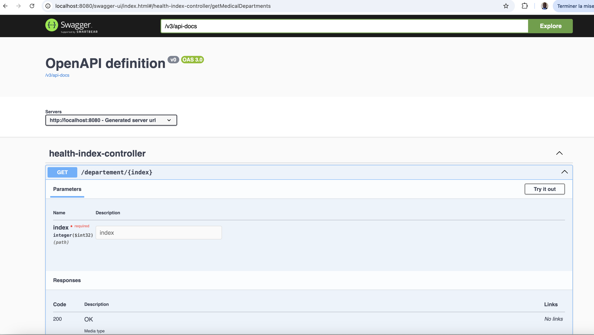

# Cabine d'Auto-Diagnostic - Système de Routage Médical
## Contexte
Ce projet fait partie d'un système d'information hospitalier permettant de traiter des diagnostics automatiques grâce à une cabine d'auto-diagnostic. La cabine génère un index de santé pour chaque patient, qui est ensuite interprété afin de diriger le patient vers les départements médicaux appropriés. L'objectif est de développer une application qui, en fonction de cet index, identifie la ou les pathologies et redirige les patients vers les bons services.

# Règles de diagnostic :
* Un index multiple de 3 indique un problème cardiaque (Cardiologie).
* Un index multiple de 5 indique une fracture (Traumatologie).
* Un index multiple de 3 et de 5 indique les deux pathologies à la fois (Cardiologie, Traumatologie).
# Exemples :
* Pour l'index de santé 33, le système renvoie Cardiologie.
* Pour l'index de santé 55, le système renvoie Traumatologie.
* Pour l'index de santé 15, le système renvoie Cardiologie, Traumatologie.
# Fonctionnalités
* Récupération de l'index de santé à partir de l'URL.
* Identification des pathologies en fonction de l'index.
* Redirection du patient vers le ou les départements concernés.
* Gestion des erreurs pour les index invalides (ex: index négatifs ou nuls).
# Architecture du projet
L'application utilise l'architecture Spring Boot pour structurer le projet en suivant les principes SOLID. Elle suit également les principes du Test-Driven Development (TDD) pour garantir la qualité du code.

# Composants principaux :
* Controller (HealthIndexController) : Gère les requêtes HTTP et dirige vers le service approprié.
* Service (PathologyRoutingService) : Contient la logique de routage médical en fonction de l'index de santé.
* Enum (HealthIndexType) : Enumère les pathologies et les conditions associées à chaque type d'index.
* Exception (InvalidIndexException) : Gestion des erreurs pour les index de santé invalides.
* Structure du projet :
```
 src/
│
├── main/
│   ├── java/com/softwaymedical/
│   │   ├── controller/HealthIndexController.java
│   │   ├── service/PathologyRoutingService.java
│   │   ├── exception/InvalidIndexException.java
│   │   └── enums/HealthIndexType.java
│   └── resources/
│       └── application.properties
│
├── test/
│   ├── java/com/softwaymedical/
│   │   ├── controller/HealthIndexControllerTest.java
│   │   └── service/PathologyRoutingServiceTest.java
│
└── pom.xml

```

# Prérequis
* JDK 17 ou plus récent.
* Maven pour la gestion des dépendances.
* Spring Boot 3.3
* Spring validation
* Lombok
* springdoc pour la documentation de l'apli
* JUnit 5 pour les tests unitaires et d'intégration.
* MockMvc pour simuler les requêtes HTTP dans les tests de contrôleur.


## Installation et exécution
* Cloner le projet :

 ``` 

 git clone https://github.com/Diags/softwaymedical.git

```
* Naviguer dans le répertoire :
```

cd softwaymedical

```

* Construire le projet avec Maven :

```

mvn clean install

```
* Exécuter l'application :
```

mvn spring-boot:run

```
* Accéder à l'API : L'application sera disponible à l'adresse :

```
http://localhost:8080/departement/{index}

  exp :

curl -X GET "http://localhost:8080/departement/15"

```
* Avec le jar 
```
java -jar target/softwaymedical-1.0.0.jar

Par defaut l'aplication sera lancer sur le port 8080. si vous souhaitez changez le port.

java -jar target/softwaymedical-1.0.0.jar --server.port=9090

curl -X GET "http://localhost:8080/departement/15"
```

# Tests

## Stratégie de Test-Driven Development (TDD)
Les tests ont été écrits en suivant la méthodologie TDD. Voici les principaux cas de tests couverts :

* Test pour un index valide (ex: multiples de 3, 5, et 15).
* Test pour un index invalide (ex: index négatifs ou nuls).
* Test pour un index sans pathologie connue (ex: 7).
* Utilisation de MockMvc pour simuler les appels HTTP dans le contrôleur.

### Exécuter les tests unitaires :

```

mvn test

```

# Accès à Swagger
```
http://localhost:8080/swagger-ui/index.html#/health-index-controller/getMedicalDepartments

```


# Resultats :
### Test index 33

### Test index 55

### Test index 15

### Test index < 0


# Régles du test : 
* ----> src/main/resources/doc/coding-test-v3.pdf
